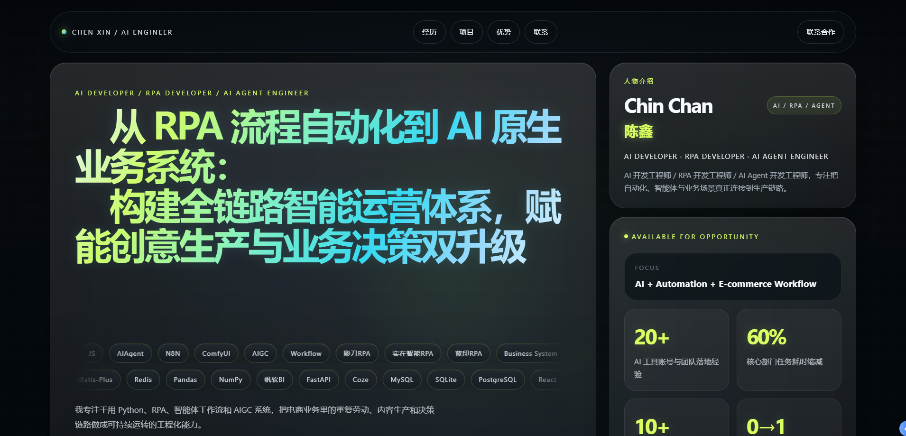
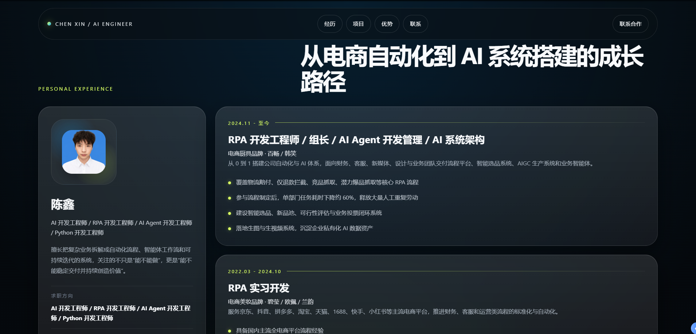

# Personal Resume Webpage

一个基于 `React + Vite` 构建的个人品牌型简历站，面向 `AI Developer / RPA Developer / AI Agent Engineer / Python Developer` 等方向，强调作品集化表达、业务落地能力展示与视觉记忆点，而不是传统模板式简历页面。

## 页面预览

在线展示：[https://chenwenwen1007.github.io/Personal-Resume-Webpage/#home](https://chenwenwen1007.github.io/Personal-Resume-Webpage/#home)

### 首页展示



### 人物信息区



## 项目定位

这个项目围绕“从 RPA 流程自动化到 AI 原生业务系统”的个人定位展开，目标是把个人经历、项目能力、技术栈和业务理解，用更适合对外展示的方式组织成一个单页站点。

适用场景：

- AI / RPA / Agent 方向求职展示
- 面试前的能力说明页
- 对外合作时的个人介绍页
- 后续扩展为完整个人站点的基础版本

## 当前已实现内容

### 1. Hero 首屏

- 视频背景与科技感网格叠层
- 固定顶部导航
- 联系合作主 CTA
- 动态打字主标题
- 双向无缝滚动技能标签
- 技能标签点击详情弹层
- 技能标签悬停独立提示层
- 右侧人物介绍卡与指标数据卡

### 2. Personal Experience

- 头像与身份信息展示
- 个人简介与求职方向
- 联系方式摘要
- 时间轴式工作经历模块

### 3. Selected Projects

- AI Agent / Workflow 方向项目
- 电商自动化流程体系项目
- AIGC 图像/视频生产系统项目

### 4. Core Strengths

- 跨角色复合能力
- 0 到 1 搭建能力
- 电商业务场景理解
- AI 工程化落地能力

### 5. Contact & Collaboration

- 联系合作入口
- 邮箱卡片与复制反馈
- 微信二维码卡片
- 联系方式弹窗与二维码预览

## 本轮更新摘要

最近一轮主要围绕首页交互和可读性做了细化：

- 技能标签滚动从“有节拍感的重复动画”改成真正闭环的无缝滚动
- 技能区边界重新收口，避免滚动内容溢出到右侧信息卡
- 技能说明提示从标签内部改成共享浮层，解决被 `skill-marquee` 裁切的问题
- 技能滚动区域的高度、留白、悬停视觉持续微调
- 悬停标签时去掉了偏重的黑色阴影效果
- 页面 `favicon` 已切换为头像资源
- 联系合作区域补充了弹窗、复制反馈与二维码预览体验

## 视觉与交互亮点

- 暗色科技感 + 玻璃拟态卡片
- Hero 标题打字动画
- 双向 marquee 技能滚动
- hover / focus 技能说明提示
- skill 点击详情弹层
- 联系合作弹窗
- 邮箱复制状态反馈
- 微信二维码放大预览

## 技术栈

### 前端

- React 19
- Vite 8

### 工程依赖

- react
- react-dom
- @vitejs/plugin-react
- eslint

## 项目结构

```text
src/
  App.jsx        页面主体结构与交互逻辑
  App.css        页面样式、动画与交互视觉
  main.jsx       应用入口与 favicon 注入
  assets/        头像、二维码等静态资源
public/
  hero-background.webm
  readme/
    banner.png
    people.png
```

## 本地运行

### 安装依赖

```bash
npm install
```

### 启动开发环境

```bash
npm run dev
```

### 生产构建

```bash
npm run build
```

### 本地预览生产包

```bash
npm run preview
```

## 部署说明

这是一个标准的 Vite 静态站点，可以直接部署到任意静态托管平台，例如：

- Vercel
- Netlify
- GitHub Pages
- Cloudflare Pages
- 任意支持静态文件托管的 Nginx 服务器

构建产物目录：

```text
dist/
```

基础部署流程：

1. 执行 `npm run build`
2. 将 `dist/` 目录上传到静态托管平台
3. 配置站点根目录为 `dist/`
4. 如需自定义域名，再补充平台侧域名解析

## GitHub Pages 部署步骤

如果你要把这个项目部署到 GitHub Pages，按下面这套流程即可。

当前仓库地址：

```text
https://github.com/Chenwenwen1007/Personal-Resume-Webpage
```

部署成功后的默认访问地址：

```text
https://chenwenwen1007.github.io/Personal-Resume-Webpage/
```

### 这个项目已经帮你处理好的内容

- `vite.config.js` 已经配置好 `base: '/Personal-Resume-Webpage/'`
- `.github/workflows/deploy.yml` 已经配置好自动部署流程
- 工作流会在你推送到 `master` 分支后自动构建并发布

### 你接下来只需要做的事

1. 提交并推送代码

```bash
git add .
git commit -m "Deploy site to GitHub Pages"
git push origin master
```

2. 打开 GitHub 仓库页面

```text
https://github.com/Chenwenwen1007/Personal-Resume-Webpage
```

3. 进入：

- `Settings`
- `Pages`

4. 在 `Build and deployment` 里确认：

- `Source` 选择的是 `GitHub Actions`

5. 再进入仓库顶部的 `Actions`

- 找到 `Deploy to GitHub Pages`
- 等待流程跑完
- 看到绿色对勾就表示部署成功

### 常见情况

- 第一次部署通常需要等待 1 到 5 分钟
- 如果页面是空白，优先检查 `Pages` 里是否选择了 `GitHub Actions`
- 如果修改后想再次更新网站，只需要重新执行：

```bash
git add .
git commit -m "update site"
git push origin master
```

GitHub 会自动重新部署，不需要你手动上传 `dist/`

## 后续可继续优化的方向

- 进一步拆分组件，降低 `App.jsx` 复杂度
- 将静态内容抽离为配置数据文件
- 增加移动端细节适配与触屏交互优化
- 补充真实项目截图、外链与成果数据
- 引入 TypeScript 与更清晰的组件边界
- 增加部署配置与 CI 自动发布流程

## 说明

当前版本更偏“个人品牌首页 + 求职作品集首页”。后续可以继续往两个方向扩展：

- 内容侧：补全真实项目案例、业务结果和外部链接
- 工程侧：组件化、数据化、TypeScript 化、部署自动化
